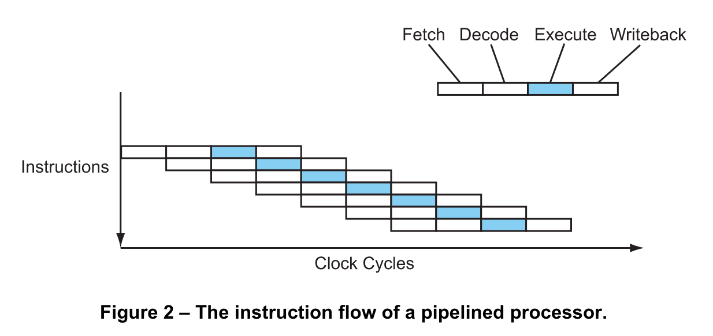

## Instruction Flow and Branch Predictions

Understanding how the hardware works is an critical component to understanding how to write the most performant code you can. Knowing the basics of processor instruction flow and branch predictions can help you make better decisions within the scope of writing idiomatic code.  

了解硬件的工作原理是了解如何编写性能最高的代码的关键组成部分。了解处理器指令流和分支预测的基础知识可以帮助您在编写惯用代码的范围内做出更好的决策。

## Acknowledgment
This content is provided by Lighterra, the software company of Jason Robert Carey Patterson. They work on a variety of software, including a cutting-edge code optimizer to make programs faster, a threading library for parallel programming, an iPhone user-interface library and a web video component.

[Modern Microprocessors](http://www.lighterra.com/papers/modernmicroprocessors/)  
[New CPU Features](http://danluu.com/new-cpu-features/)

## Notes

* Each instruction takes 4 cycles over 4 stages (Fetch, Decode, Execute, Writeback)  
  每条指令在 4 个阶段（提取、解码、执行、回写）上需要 4 个周期  
  
* Pipelines allows these stages to happen concurrently by overlapping each stage.  
  管道允许这些阶段通过重叠每个阶段同时发生。  
  
* Branching requires prediction to keep the pipleline running efficiently.  
  分支需要预测以保持管道有效运行。  
  
* Barch mispredictions cause a lot of performance problems.  
  Barch 错误预测会导致很多性能问题。

### Basic Instruction Flow
Instructions are executed one after the other inside the processor, right? Well, that makes it easy to understand, but that's not really what happens. In fact, that hasn't happened since the middle of the 1980s. Instead, several instructions are all partially executing at the same time.  
指令在处理器内部一个接一个执行，对吗？嗯，这很容易理解，但事实并非如此。事实上，这种情况自 1980 年代中期以来就没有发生过。取而代之的是，几条指令都在同一时间部分执行。

Consider how an instruction is executed – first it is fetched, then decoded, then executed by the appropriate functional unit, and finally the result is written into place. With this scheme, a simple processor might take 4 cycles per instruction (CPI = 4)...  
考虑一条指令是如何执行的——首先取指令，然后解码，然后由适当的功能单元执行，最后将结果写入到位。使用这种方案，一个简单的处理器可能每条指令需要 4 个周期 (CPI = 4)...

Modern processors overlap these stages in a pipeline, like an assembly line. While one instruction is executing, the next instruction is being decoded, and the one after that is being fetched...  
现代处理器在流水线中重叠这些阶段，就像装配线一样。在执行一条指令时，正在解码下一条指令，然后正在提取下一条指令......

Now the processor is completing 1 instruction every cycle (CPI = 1). This is a four-fold speedup without changing the clock speed at all. Not bad, huh?

### Basic Branch Prediction
A key problem of pipelining is branches. Consider the following code sequence...

	01 if (a > 7) {
	02    b = c;
	03 } else {
	04    b = d;
	05 }

Now consider a pipelined processor executing this code sequence. By the time the conditional branch at line 01 reaches the execute stage in the pipeline, the processor must have already fetched and decoded the next couple of instructions. But which instructions? Should it fetch and decode the if branch (line 02) or the else branch (line 04)? It won't really know until the conditional branch gets to the execute stage, but in a deeply pipelined processor that might be several cycles away. And it can't afford to just wait – the processor encounters a branch every six instructions on average, and if it was to wait several cycles at every branch then most of the performance gained by using pipelining in the first place would be lost.  
现在考虑一个执行此代码序列的流水线处理器。当第 01 行的条件分支到达流水线中的执行阶段时，处理器必须已经提取并解码了接下来的几条指令。但是哪个指令？它应该获取和解码 if 分支（第 02 行）还是 else 分支（第 04 行）？直到条件分支到达执行阶段，它才会真正知道，但在可能有几个周期的深度流水线处理器中。而且它不能等待——处理器平均每 6 条指令遇到一个分支，如果它在每个分支上等待几个周期，那么最初通过使用流水线获得的大部分性能都会丢失。

So the processor must make a guess. The processor will then fetch down the path it guessed and speculatively begin executing those instructions. Of course, it won't be able to actually commit (writeback) those instructions until the outcome of the branch is known. Worse, if the guess is wrong the instructions will have to be cancelled, and those cycles will have been wasted. But if the guess is correct the processor will be able to continue on at full speed.  
所以处理器必须做出猜测。然后处理器将沿着它猜测的路径取回并推测性地开始执行这些指令。当然，在知道分支的结果之前，它无法实际提交（写回）这些指令。更糟糕的是，如果猜测是错误的，则指令将不得不被取消，而这些周期将被浪费掉。但如果猜测正确，处理器将能够继续全速运行

Nonetheless, even the very best modern processors with the best, smartest branch predictors only reach a prediction accuracy of about 95%, and still lose quite a lot of performance due to branch mispredictions.  
尽管如此，即使是拥有最好、最智能的分支预测器的最好的现代处理器也只能达到大约 95% 的预测准确度，并且仍然会由于分支预测错误而损失相当多的性能。
## Links

http://www.lighterra.com/papers/modernmicroprocessors/  
http://archive.arstechnica.com/cpu/1q00/crusoe/m-crusoe-1.html

## Code Review

[Tests](prediction_test.go) ([Go Playground](https://play.golang.org/p/kvAjELs4BzM))
___
All material is licensed under the [Apache License Version 2.0, January 2004](http://www.apache.org/licenses/LICENSE-2.0).